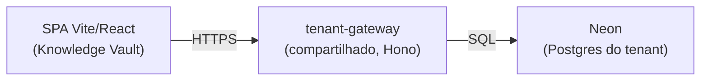

# Knowledge Vault

> **Documento 01 — Arquitetura, Stack e Modelagem**
>
> **Status:** Aprovado
>
> **Escopo:** Este documento define a stack técnica, o modelo físico do banco, a estratégia de acesso a dados e como o modelo de domínio dos ADRs (001–005) se traduz em tabelas reais sobre a fundação MasIA. Substitui o "Documento 02" originalmente prometido em [doc/product/01-visao-geral.md](../product/01-visao-geral.md) e nunca escrito (a numeração mudou porque este documento agora vive na árvore `doc/architecture/`, numerada independentemente de `doc/product/`).

---

# 0. Topologia-alvo e Superfícies deste App

## 0.1 Topologia-alvo



`[SPA Vite/React] --HTTPS--> [tenant-gateway compartilhado] --SQL--> [Neon do tenant]`. O gateway resolve o tenant por hostname (produção, via edge worker) ou pelo header `X-Tenant-Id` (dev local) — nunca por lógica no app. [Source: Importantdoc.md#B1]

## 0.2 Onde tudo mora

| Peça | Localização |
|---|---|
| Este app (Knowledge Vault) | `knowledge/` (SPA Vite/React) |
| Gateway (backend compartilhado) | repo separado `Cerebra-AI/tenant-gateway`, deploy Fly |
| Edge worker (injeta tenant em runtime) | `masia/clone-templates/edge-worker/` |
| Migrations do schema deste app | `knowledge/supabase/migrations/` (roda no Neon do tenant) |

[Source: Importantdoc.md#B2]

## 0.3 Proibições duras

- **Sem backend próprio.** Nenhum servidor Express/Nest/Next por-app. O backend é sempre o `tenant-gateway` compartilhado.
- **Sem BaaS alternativo.** Nunca `@supabase`, Firebase, ou qualquer driver SQL rodando no browser.
- **Sem RLS, sem `auth.uid()`, sem tabela `profiles`.** A autorização é 100% no gateway (app-layer) — o Neon deste tenant guarda só o schema de negócio.
- **Sem acesso direto ao banco.** Toda leitura/escrita passa por `db`/`auth` (`src/lib/data/client.ts`).

[Source: Importantdoc.md#B1][Source: Importantdoc.md#B3]

## 0.4 As 3 superfícies de trabalho deste app (e somente elas)

1. **Schema/migration no Neon** — `supabase/migrations/*.sql`, seguindo as regras §B4 da fundação (seção 3 abaixo).
2. **Camada de dados do app** — `src/lib/data/*.repo.ts`, falando com o gateway via `db.table()`.
3. **Extensões explícitas do gateway** — quando o produto precisa de algo fora do CRUD genérico (ex.: rota Publicar, seção 5), é pedido como extensão pontual do `tenant-gateway`, nunca resolvido criando servidor próprio.

## 0.5 Isolamento físico

Cada cliente (tenant) tem **1 projeto Neon dedicado** — os dados de um tenant nunca compartilham banco com outro. O app nunca sabe disso: ele só fala com o gateway via `db`/`auth`, e é o gateway que resolve qual Neon atender. [Source: Importantdoc.md#B1]

---

# 1. Stack Tecnológica

A stack não é uma escolha livre deste projeto — é imposta pela fundação MasIA (`Importantdoc.md`, PARTE B). Qualquer desvio quebra o modelo de clone/publish da fundação.

| Camada    | Tecnologia                                   | Observação                                                                 |
| --------- | --------------------------------------------- | --------------------------------------------------------------------------- |
| Framework | React 19                                      |                                                                               |
| Build     | Vite 6 (SPA estático)                         | `tsc && vite build`. Sem Next.js, sem SSR/SSG.                              |
| Rotas     | react-router-dom 7                            | `BrowserRouter`, SPA                                                        |
| Linguagem | TypeScript strict (`noUnusedLocals`)          | imports não usados quebram o build                                          |
| Dados     | gateway via `db` (`src/lib/data/client.ts`)   | nunca `@supabase`, fetch cru pro banco, ou driver SQL no browser            |
| Auth      | Better-Auth via `auth` (`client.ts`)          | nunca implementar auth própria                                              |
| Banco     | Postgres (Neon) — só schema (migration)       | sem RLS, sem `auth.uid()`, 1 banco por tenant                               |

**Proibido:** backend próprio, Supabase, Firebase, ORM no browser, SSR.

---

# 2. Limitações do CRUD genérico e suas implicações de design

O gateway expõe apenas `GET/POST/PATCH/DELETE /data/:table` — `list / create / update / remove`. Não existe `getById`, filtro por query, nem join. Isso não é um detalhe de implementação: **é a restrição que molda todo o modelo de domínio abaixo.**

Consequências diretas:

- **Sem `getById`** → as telas fazem `list()` e resolvem o item por `id` no client (list-then-find).
- **Sem filtro no servidor** → coleções completas são carregadas e filtradas em memória (busca, árvore de pastas, grafo).
- **Sem join** → toda relação (documento → pasta, referência → documento) é resolvida no client cruzando listas já carregadas, nunca no banco.
- **`owner_id` nunca é enviado pelo front** — o gateway o preenche a partir da sessão.
- **Visibilidade é decidida por tabela, não por linha:**
  - Tabela **com** `owner_id`: `rep` vê só as próprias linhas; `admin`/`manager`/`owner` veem tudo.
  - Tabela **sem** `owner_id` (lookup): leitura liberada a qualquer usuário logado; escrita só `admin`/`manager`.

Esse último ponto é o motivo pelo qual a base de conhecimento compartilhada (seção 5) precisa de uma tabela própria — não existe um "modo público" dentro de uma tabela que já tem `owner_id`.

---

# 3. Modelo de Domínio → Tabelas

O domínio conceitual (Folder, Document, Reference, Favorite — ADR-004/005) se traduz em **6 tabelas físicas**, seguindo as regras de schema da fundação (`Importantdoc.md`, B4): `owner_id text references "user"(id)` em toda tabela escrita por `rep` (inclusive filhas), `snake_case`, `uuid` PK, sem RLS.

## 3.1 `folders` — vault pessoal, organização

```sql
create table if not exists folders (
  id          uuid primary key default gen_random_uuid(),
  owner_id    text not null references "user"(id) on delete cascade,
  parent_id   uuid references folders(id) on delete cascade,
  name        text not null,
  created_at  timestamptz not null default now(),
  updated_at  timestamptz not null default now()
);
create index if not exists idx_folders_owner on folders(owner_id);
create index if not exists idx_folders_parent on folders(parent_id);
```

## 3.2 `documents` — vault pessoal (Markdown, único tipo)

Todo documento é Markdown (ADR-004). Sem campo de tipo, sem colunas de arquivo binário.

```sql
create table if not exists documents (
  id          uuid primary key default gen_random_uuid(),
  owner_id    text not null references "user"(id) on delete cascade,
  folder_id   uuid references folders(id) on delete set null,
  title       text not null,
  content     text not null default '',
  created_at  timestamptz not null default now(),
  updated_at  timestamptz not null default now()
);
create index if not exists idx_documents_owner on documents(owner_id);
create index if not exists idx_documents_folder on documents(folder_id);
```

Não há campo de estado "lixeira" (ADR-002): se a linha existe, o documento está ativo.

## 3.3 `shared_documents` — base de conhecimento curada

**Tabela lookup**: sem `owner_id`. Leitura liberada a qualquer usuário logado do tenant; escrita restrita a `admin`/`manager` (regra B4.6 da fundação).

```sql
create table if not exists shared_documents (
  id                  uuid primary key default gen_random_uuid(),
  title               text not null,
  content             text not null default '',
  source_document_id  uuid,              -- rastreabilidade apenas — sem FK real (o doc de origem pode ser excluído sem afetar a cópia)
  published_by        text not null references "user"(id),
  created_at          timestamptz not null default now(),
  updated_at          timestamptz not null default now()
);
```

## 3.4 `document_references` — referências dentro do vault pessoal

Escrita por `rep` (o dono do documento fonte), por isso precisa de `owner_id` (regra B4.1 — tabela-filha sem `owner_id` recebe 403 de um `rep`).

```sql
create table if not exists document_references (
  id                  uuid primary key default gen_random_uuid(),
  owner_id            text not null references "user"(id) on delete cascade,
  source_document_id  uuid not null references documents(id) on delete cascade,
  target_scope        text not null,     -- 'personal' | 'shared'
  target_document_id  uuid not null,     -- aponta pra documents.id (personal) ou shared_documents.id (shared)
  created_at          timestamptz not null default now()
);
create index if not exists idx_document_references_owner on document_references(owner_id);
create index if not exists idx_document_references_source on document_references(source_document_id);
```

`target_document_id` não tem FK real porque pode apontar pra duas tabelas diferentes dependendo de `target_scope` — a integridade é validada na aplicação, não no banco (consistente com "sem RLS/joins" da fundação).

## 3.5 `shared_document_references` — referências dentro da base compartilhada

Um documento compartilhado só pode referenciar outro documento compartilhado (ver seção 5.2). Escrita só `admin`/`manager` — sem `owner_id`, mesmo padrão de `shared_documents`.

```sql
create table if not exists shared_document_references (
  id                          uuid primary key default gen_random_uuid(),
  source_shared_document_id  uuid not null references shared_documents(id) on delete cascade,
  target_shared_document_id  uuid not null references shared_documents(id) on delete cascade,
  created_at                  timestamptz not null default now()
);
```

## 3.6 `favorites` — confirmado no MVP

```sql
create table if not exists favorites (
  id              uuid primary key default gen_random_uuid(),
  owner_id        text not null references "user"(id) on delete cascade,
  document_scope  text not null,   -- 'personal' | 'shared'
  document_id     uuid not null,
  created_at      timestamptz not null default now()
);
create unique index if not exists uq_favorites_owner_doc on favorites(owner_id, document_scope, document_id);
create index if not exists idx_favorites_owner on favorites(owner_id);
```

---

# 4. Matriz de visibilidade (derivada da regra B8 da fundação)

| Tabela                        | `rep` lê       | `rep` escreve  | `admin`/`manager` lê | `admin`/`manager` escreve |
| ------------------------------ | -------------- | -------------- | --------------------- | -------------------------- |
| `folders`                      | próprias       | próprias       | todas                  | todas                       |
| `documents`                    | próprios       | próprios       | todos                  | todos                       |
| `document_references`          | próprias       | próprias       | todas                  | todas                       |
| `favorites`                    | próprias       | próprias       | todas                  | todas                       |
| `shared_documents`             | todas          | ❌ (403)        | todas                  | todas                       |
| `shared_document_references`   | todas          | ❌ (403)        | todas                  | todas                       |

`role` (`auth.me()`) é usado **só pra UI** (esconder botão de "Publicar" pra `rep`); a segurança real é aplicada pelo gateway.

---

# 5. Base de Conhecimento Compartilhada (curadoria pelo admin)

Esta era a questão em aberto original: *"cada um tem seu vault, mas o admin pode selecionar os melhores docs e disponibilizar pro resto."*

## 5.1 Por que não dá pra fazer com uma flag `published` em `documents`

A visibilidade do gateway é decidida **por tabela**, olhando `owner_id`. Um `rep` que faz `list()` em `documents` só recebe as próprias linhas, **independentemente do valor de qualquer coluna** — uma flag `published = true` não muda esse comportamento porque o filtro é aplicado antes de qualquer coluna de negócio ser avaliada. A única forma de um `rep` enxergar conteúdo de outro usuário é uma tabela **sem** `owner_id` (lookup).

## 5.2 Fluxo de publicação

1. `admin`/`manager` abre um documento (o seu ou de qualquer `rep`, já que eles enxergam tudo em `documents`).
2. Aciona "Publicar" → a aplicação faz `create` em `shared_documents`, copiando `title`/`content`, e gravando `source_document_id` (rastreabilidade) e `published_by`.
3. A partir daí, `shared_documents` é uma **cópia independente** — editar o original em `documents` não atualiza a versão publicada, e vice-versa. Não existe sincronização automática (ver limitação abaixo).
4. Reference: um Markdown do vault pessoal pode referenciar um documento compartilhado (`document_references.target_scope = 'shared'`). Um documento compartilhado só pode referenciar outro documento compartilhado (`shared_document_references`) — **nunca** um documento pessoal, porque isso criaria um link quebrado para qualquer outro usuário que não seja o dono.

## 5.3 Limitação assumida (decisão consciente, não bug)

A cópia diverge do original com o tempo. Isso é aceito em troca de simplicidade: manter uma referência "viva" entre as duas tabelas exigiria sincronização ou um `getById` cross-table que o gateway não oferece. Se isso virar um problema real de produto, a alternativa é pedir uma extensão pontual no gateway (endpoint de "publish" que espelha atualizações) — mas isso está fora do escopo do CRUD genérico atual.

---

# 6. Grafo e Backlinks (cálculo 100% client-side)

Sem persistir nenhuma estrutura derivada (ADR-005), o grafo é montado assim:

1. Carregar `documents` (retorna só os próprios, exceto para `admin`/`manager`) e `shared_documents` (retorna tudo).
2. Carregar `document_references` (próprias) e `shared_document_references` (tudo).
3. Mesclar em memória: nós = documentos visíveis pro usuário atual (pessoais + compartilhados); arestas = as duas tabelas de referência.
4. Backlinks de um documento = arestas cujo alvo é aquele documento, resolvidas no mesmo grafo em memória.

Pastas nunca entram no grafo (ADR-004/005).

---

# 7. Busca

V1: apenas título, sobre `documents` (visíveis) + `shared_documents` + `folders`, filtrado em memória após `list()`. Sem full-text (ADR-004).

---

# 8. Organização do Frontend

Formalizada em **[Documento 02 — Organização do Frontend](./02-organizacao-frontend.md)**: estrutura completa de pastas, responsabilidade de cada camada, fluxo de dados ponta-a-ponta, estratégia de cache e mapeamento pro `editable.allow`/`protect` do `masi.template.json`.

---

# 9. Decisões ainda em aberto

Estas dependem de validação sua — não foram assumidas unilateralmente (conforme a regra de `doc/agendSkill/AgentDev.md`, seção "Arquitetura"):

- **Fluxo de auth ponta-a-ponta por tela**: o que exatamente cada papel vê na Sidebar/Dashboard (ex.: `rep` vê "Publicado por mim"? `admin` tem uma tela de moderação da base compartilhada?).

Quando essas decisões forem tomadas, registrar como ADR-006 em diante, seguindo o padrão dos ADRs existentes.

> Estratégia de cache/data-fetching **não está mais em aberto** — TanStack Query, confirmado, no [Documento 02, §6](./02-organizacao-frontend.md#6-estratégia-de-cache).
>
> **Upload/armazenamento de arquivo binário (PDF/DOCX) foi removido do escopo do produto.** O antigo ADR-006 (Worker Cloudflare + R2) foi descartado — o Knowledge Vault é markdown-only (ADR-004).
